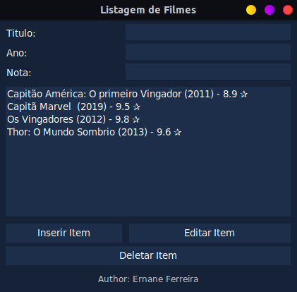

<h1 align="center">
  <strong>Sistema para listagens de Filmes</strong>
</h1>

<div align="center">
  <a href="#-Tecnologias">Tecnologias</a>&nbsp;&nbsp;&nbsp;|&nbsp;&nbsp;&nbsp;
  <a href="#-Projeto">Projeto</a>&nbsp;&nbsp;&nbsp;|&nbsp;&nbsp;&nbsp;
  <a href="#-Use">Use</a>&nbsp;&nbsp;&nbsp;
</div>

<br>

<div align="center">
  
</div>

</p>

## 🚀 Tecnologias

Esta aplicação foi desenvolvida com as seguintes tecnologias:

- Python 3.8.10
  - tkinter — Interface Python para Tcl/Tk

## 💻 Projeto
<p>
Este projeto tem como objetivo fixar o estudo de Programação Orientada a Objetos tomando como base a linguagem Python, bem como o padrão de projetos MVC (do inglês - model, view e conrollers). Dentre as suas funcionalidades, podemos contar com:

- [x] Adicionar
- [x] Editar
- [x] Deletar

O projeto consiste basicamente em um CRUD (Create, read, update and delete), onde o usuário poderá tratar os seus filmes assistidos. O sistema conta com uma forma de salvar os filmes para que os dados inseridos não sejam perdidos utilizado-se de um arquivo `.txt` para escrever os dados recebidos do usuário.

O mesmo também conta com tratamento de erros e exceções para que qualquer má utilização do sistema, vinda por parte do usuário, seja prevenida e lhe permita obter um retorno visual do erro, sendo utilizada a própria `GUI` (Graphical user interface) do sistema.
</p>

## 💡 Use
- Baixe o arquivo `.zip` do projeto

  <a href="./pratica15.zip" download>
    🔗 Baixar
  </a>

- Ou clone este repositorio

  ```bash
  $ git clone https://github.com/ErnaneJ/lista-de-filmes.git
  ```

##### * se você quiser adicionar alguma nova funcionalidade, ou implementar alguma melhoria. Faça uma solicitação de pull, eu irei adorar receber!

---

<div align="center">
  Developed with ❤ by <a target="_blank" href="https://ernanej.github.io/my-linktree/">Ernane Ferreira</a>. 👋🏻
  <br/>
  <small>Projeto criado a partir da pratica <a href="https://ect-info.github.io/POO_2021.1/">14.b</a> do curso de <a href="https://github.com/ect-info/POO_2021.1">Programacao Orientada a Objeto (POO)</a> na <a href="https://www.ect.ufrn.br/">Escola de Ciencias e Tecnologia (ECT)</a> da <a href="https://www.ufrn.br/">Universidade Federal do Rio Grande do Norte (UFRN)</a> durante o semestre 2021.1.<small>
</div>
